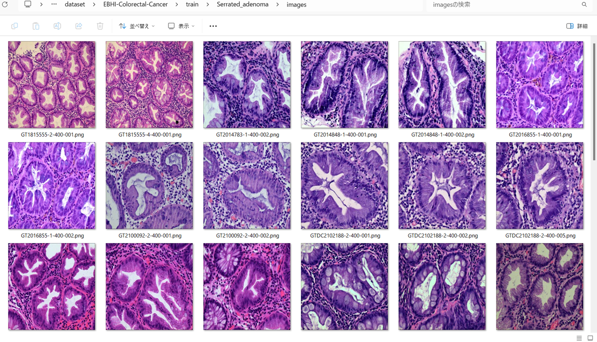
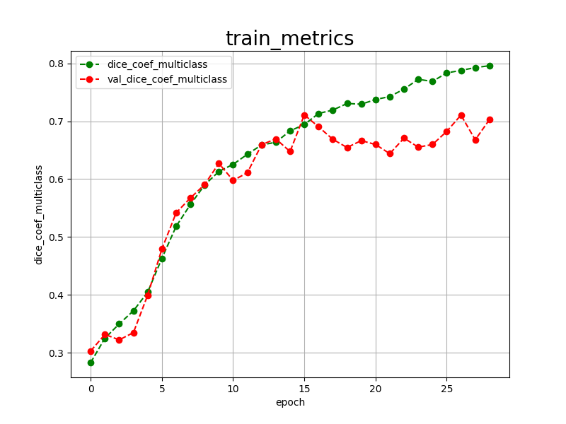
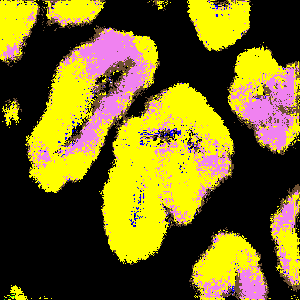

<h2>TensorFlow-FlexUNet-Image-Segmentation-EBHI-Colorectal-Cancer (2025/06/24)</h2>

This is the first experiment of Image Segmentation for EBHI-Colorectal-Cancer 
 based on our TensorFlowFlexUNet (TensorFlow Flexible UNet Image Segmentation Model for Multiclass) 
and, 512x512 pixels <a href="https://drive.google.com/file/d/1FjSrzDl_6lYPD45c8cIsGn5-lZf1OfTM/view?usp=sharing">
EBHI-Colorectal-Cancer-ImageMaskDataset.zip</a>, 
which was derived by us from 
<a href="https://figshare.com/articles/dataset/EBHI-SEG/21540159/1?file=38179080"><b>EBHI-SEG</b></a>
 
 
Please see also our experiment for EBHI-SEG Polyp
<a href="https://github.com/sarah-antillia/Tensorflow-Image-Segmentation-EBHI-SEG-Colorectal-Cancer">Tensorflow-Image-Segmentation-EBHI-SEG-Colorectal-Cancer
</a>
 
 

<b>Actual Image Segmentation for Images of 512x512 pixels</b> 
As shown below, the inferred masks predicted by our segmentation model, which was trained on the PNG dataset, 
appear similar to the ground truth masks. However, the class (color) classification yielded unsatisfactory results, 
possibly due to an imbalanced dataset problem. Specifically, the number of images and masks for the Normal and 
Serrated_adenoma subsets in the original EBHI-SEG dataset is very small compared to other subsets.
  
<table>
<tr>
<th>Input: image</th>
<th>Mask (ground_truth)</th>
<th>Prediction: inferred_mask</th>
</tr>
<tr>
<td></td>
<td></td>
<td></td>
</tr>

<tr>
<td></td>
<td></td>
<td></td>
</tr>

<tr>
<td></td>
<td></td>
<td></td>
</tr>
</table>

 

<h3>1. Dataset Citation</h3>
In this experiment, we used the following datataset in figshare.com: 
<a href="https://figshare.com/articles/dataset/EBHI-SEG/21540159/1?file=38179080"><b>EBHI-SEG</b></a>
 
 
<b>About dataset</b> 

This publicly available dataset contained 5,170 images of six types of tumor differentiation stages  
and the corresponding ground truth images.  
The dataset can provide researchers with new segmentation algorithms for medical diagnosis of colorectal  
cancer, which can be used in the clinical setting to help doctors and patientsThe dataset in the present  
study contained 5,710 histopathology images, including 2,855 histopathology section images and 2,855  
ground truth images. 
 

Please see also: 
<b>EBHI-Seg: A novel enteroscope biopsy histopathological hematoxylin and eosin image dataset for image segmentation tasks</b>
<a href="https://www.frontiersin.org/articles/10.3389/fmed.2023.1114673/full">
https://www.frontiersin.org/articles/10.3389/fmed.2023.1114673/full
</a>
 

<h3>
<a id="2">
2 EBHI-Colorectal-Cancer ImageMask Dataset
</a>
</h3>
 If you would like to train this EBHI-Colorectal-Cancer Segmentation model by yourself,
 please download the dataset from the google drive  512x512 pixels
<a href="https://drive.google.com/file/d/1FjSrzDl_6lYPD45c8cIsGn5-lZf1OfTM/view?usp=sharing">
EBHI-Colorectal-Cancer-ImageMaskDataset.zip</a>
, expand the downloaded ImageMaskDataset and put it under <b>./dataset</b> folder to be
<pre>
                    (The Numbef of files)
./dataset
./EBHI-Colorectal-Cancer
├─test
│  ├─Adenocarcinoma
│  │  ├─images          ( 80)
│  │  └─masks           ( 80)
│  ├─High-grade_IN
│  │  ├─images          ( 19)
│  │  └─masks           ( 19)
│  ├─Low-grade_IN
│  │  ├─images          ( 65)
│  │  └─masks           ( 65)
│  ├─Normal
│  │  ├─images          (  8)
│  │  └─masks           (  8)
│  ├─Polyp
│  │  ├─images          ( 49)
│  │  └─masks           ( 49)
│  └─Serrated_adenoma
│      ├─images          (  7)
│      └─masks           (  7)
├─train
│  ├─Adenocarcinoma
│  │  ├─images          (556)
│  │  └─masks           (556)
│  ├─High-grade_IN
│  │  ├─images          (130)
│  │  └─masks           (130)
│  ├─Low-grade_IN
│  │  ├─images          (445)
│  │  └─masks           (445)
│  ├─Normal
│  │  ├─images          ( 53)
│  │  └─masks           ( 53)
│  ├─Polyp
│  │  ├─images          (331)
│  │  └─masks           (331)
│  └─Serrated_adenoma
│      ├─images          ( 40)
│      └─masks           ( 40)
└─valid
    ├─Adenocarcinoma
    │  ├─images          (159)
    │  └─masks           (159)
    ├─High-grade_IN
    │  ├─images          ( 37)
    │  └─masks           ( 37)
    ├─Low-grade_IN
    │  ├─images          (127)
    │  └─masks           (127)
    ├─Normal
    │  ├─images          ( 15)
    │  └─masks           ( 15)
    ├─Polyp
    │  ├─images          ( 94)
    │  └─masks           ( 94)
    └─Serrated_adenoma
        ├─images          ( 11)
        └─masks           ( 11)
</pre>
 
<b>As shown above, this is a typical imbalanced dataset, because the number of 
images and masks of <b>Normal</b> and 
<b> Serrated_adenoma </b> subsets is very small compared to other subsets.</b> 
 
We used Python script 
<a href="./generator/ImageMaskDatasetGenerator.py">ImageMaskDatasetGenerator.py</a> 
to derive this 512x512 pixels PNG dataset. 
 
If you would like to generate a pre-augmented dataset by yourself, you may set the augmentation 
parameter to True as shown below: 
<pre>
    resize       = 512
    augmentation = True
    generator = EBHIColorectalImageMaskDatasetGenerator(resize=resize, augmentation=augmentation)
</pre>
 
 
<b>Adenocarcinoma Train_images_sample</b> 

 
<b>Adenocarcinoma Train_masks_sample</b> 

 
 
<b>High-grade_IN Train_images_sample</b> 

 
<b>High-grade_IN Train_masks_sample</b> 

 
 
<b>Low-grade_IN Train_images_sample</b> 

 
<b>Low-grade_IN Train_masks_sample</b> 

 
<b>Normal Train_images_sample</b> 

 
<b>Normal Train_masks_sample</b> 

 

<b>Polyp Train_images_sample</b> 

 
<b>Polyp Train_masks_sample</b> 

 

<b>Serrated_adenoma Train_images_sample</b> 

 
<b>Serrated_adenoma Train_masks_sample</b> 

 
 
<h3>
3 Train TensorFlowFlexUNet Model
</h3>
 We have trained EBHI-Colorectal-CancerTensorFlowFlexUNet Model by using the following
<a href="./projects/TensorFlowFlexUNet/EBHI-Colorectal-Cancer/train_eval_infer.config"> <b>train_eval_infer.config</b></a> file.  
Please move to ./projects/TensorFlowFlexUNet/EBHI-Colorectal-Cancerand run the following bat file. 
<pre>
>1.train.bat
</pre>
, which simply runs the following command. 
<pre>
>python ../../../src/TensorFlowFlexUNetTrainer.py ./train_eval_infer.config
</pre>

<b>Model parameters</b> 
Defined a small <b>base_filters</b> and large <b>base_kernels</b> for the first Conv Layer of Encoder Block of 
<a href="./src/TensorFlowFlexUNet.py">TensorFlowFlexUNet.py</a> 
and a large num_layers (including a bridge between Encoder and Decoder Blocks).
<pre>
[model]
base_filters   = 16
base_kernels   = (9,9)
num_layers     = 8
num_classes    = 7
dilation       = (1,1)
</pre>

<b>Learning rate</b> 
Defined a very small learning rate.  
<pre>
[model]
learning_rate  = 0.00005
</pre>

<b>Online augmentation</b> 
Disabled our online augmentation.You may train this model by setting this generator parameter to True. 
<pre>
[model]
model         = "TensorFlowFlexUNet"
generator     = False
</pre>

<b>Loss and metrics functions</b> 
Specified "categorical_crossentropy" and <a href="./src/dice_coef_multiclass.py">"dice_coef_multiclass"</a>. 
<pre>
[model]
loss           = "categorical_crossentropy"
metrics        = ["dice_coef_multiclass"]
</pre>
<b>Learning rate reducer callback</b> 
Enabled learing_rate_reducer callback, and a small reducer_patience.
<pre> 
[train]
learning_rate_reducer = True
reducer_factor     = 0.5
reducer_patience   = 4
</pre>
<b>Dataset path</b> 
Used wildcards in the data paths to include all images and masks for each category.
<pre>
[train]
mages_dir  = "../../../dataset/EBHI-Colorectal-Cancer/train/*/images/"
masks_dir  = "../../../dataset/EBHI-Colorectal-Cancer/train/*/masks/"
[valid]
images_dir = "../../../dataset/EBHI-Colorectal-Cancer/valid/*/images/"
masks_dir  = "../../../dataset/EBHI-Colorectal-Cancer/valid/*/masks/"
</pre>
<b>Early stopping callback</b> 
Enabled early stopping callback with patience parameter.
<pre>
[train]
patience      = 10
</pre>
<b>Mask RGB_map</b> 
[mask]
<pre>
mask_datatype    = "categorized"
mask_datatype    = "categorized"
mask_file_format = ".png"
;EBHI-Colorectal-Cancer rgb color map dict for 1+6 classes.

;# RGB
;   mask_colors = [(110,  80,  50),   # mustard 1
;                  (240, 130, 240),   # violet  2
;                  (255, 255,   0),   # yellow  3
;                  (255, 255,  255),  # white   4
;                  (  0, 255,   0),   # green   5
;                  (  0,   0, 255)]   # blue    6
; Background:black, 
rgb_map = {(0,0,0):0, (110,80,50):1, (240,130,240):2, (255,255,0):3, (255,255,255):4, (0,255,0):5, (0,0,255):6 }
</pre>
<b>Epoch change inference callbacks</b> 
Enabled epoch_change_infer callback. 
<pre>
[train]
epoch_change_infer       = True
epoch_change_infer_dir   =  "./epoch_change_infer"
epoch_changeinfer        = False
epoch_changeinfer_dir    = "./epoch_changeinfer"
num_infer_images         = 6
</pre>

By using this callback, on every epoch_change, the inference procedure can be called
 for 6 images in <b>mini_test</b> folder. This will help you confirm how the predicted mask changes 
 at each epoch during your training process.  
As shown below, early in the model training, the predicted masks from our UNet segmentation model showed 
discouraging results.
 However, as training progressed through the epochs, the predictions gradually improved. 
   
 
<b>Epoch_change_inference output at starting (epoch 1,2,3)</b> 
 
 

<b>Epoch_change_inference output at middlepoint (epoch 13,14,15)</b> 
 
 
<b>Epoch_change_inference output at ending (epoch 27,28,29)</b> 
 
 

In this experiment, the training process was stopped at epoch 29 by EarlyStopping callback.  
 
 

<a href="./projects/TensorFlowFlexUNet/EBHI-Colorectal-Cancer/eval/train_metrics.csv">train_metrics.csv</a> 
 

 
<a href="./projects/TensorFlowFlexUNet/EBHI-Colorectal-Cancer/eval/train_losses.csv">train_losses.csv</a> 
 

 

<h3>
4 Evaluation
</h3>
Please move to <b>./projects/TensorFlowFlexUNet/EBHI-Colorectal-Cancer</b> folder, 
and run the following bat file to evaluate TensorFlowFlexUNet model for EBHI-Colorectal-Cancer. 
<pre>
./2.evaluate.bat
</pre>
This bat file simply runs the following command.
<pre>
python ../../../src/TensorFlowFlexUNetEvaluator.py ./train_eval_infer_aug.config
</pre>

Evaluation console output: 

  Image-Segmentation-EBHI-Colorectal-Cancer

<a href="./projects/TensorFlowFlexUNet/EBHI-Colorectal-Cancer/evaluation.csv">evaluation.csv</a> 

The loss (bce_dice_loss) to this EBHI-Colorectal-Cancer/test was not low, and dice_coef very not high as shown below.
 
<pre>
categorical_crossentropy,0.779
dice_coef_multiclass,0.6479
</pre>
 

<h3>
5 Inference
</h3>
Please move to a <b>./projects/TensorFlowFlexUNet/EBHI-Colorectal-Cancer</b> folder 
,and run the following bat file to infer segmentation regions for images by 
the trained TensorFlowFlexUNet model for EBHI-Colorectal-Cancer. 
<pre>
./3.infer.bat
</pre>
This simply runs the following command.
<pre>
python ../../../src/TensorFlowFlexUNetInferencer.py ./train_eval_infer_aug.config
</pre>

<b>mini_test_images</b> 
 
<b>mini_test_mask(ground_truth)</b> 
 

<b>Inferred test masks</b> 
 
 

<b>Enlarged images and masks </b> 

<table>
<tr>
<th>Image</th>
<th>Mask (ground_truth)</th>
<th>Inferred-mask</th>
</tr>
<tr>
<td></td>
<td></td>
<td></td>
</tr>
<tr>
<td></td>
<td></td>
<td></td>
</tr>
<tr>
<td></td>
<td></td>
<td></td>
</tr>
<tr>
<td></td>
<td></td>
<td></td>
</tr>

<tr>
<td></td>
<td></td>
<td></td>
</tr>

<tr>
<td></td>
<td></td>
<td></td>
</tr>

</table>

 

<h3>
References
</h3>

<b>1. EBHI-SEG</b> 
figshare.com 
<a href="https://figshare.com/articles/dataset/EBHI-SEG/21540159/1">
https://figshare.com/articles/dataset/EBHI-SEG/21540159/1
</a> 
 

<b>2. EBHI-Seg: A novel enteroscope biopsy histopathological hematoxylin and eosin image dataset for image segmentation tasks</b> 
Liyu Shi, Xiaoyan Li, Weiming Hu, Haoyuan Chen, Jing Chen, Zizhen Fan, Minghe Gao, Yujie Jing, 
 Guotao Lu1 Deguo Ma, Zhiyu Ma, Qingtao Meng, Dechao Tang, Hongzan Sun 
<a href="https://www.frontiersin.org/articles/10.3389/fmed.2023.1114673/full">
https://www.frontiersin.org/articles/10.3389/fmed.2023.1114673/full
</a>
 
 
<b>3. Tensorflow-Image-Segmentation-EBHI-Colorectal-Cancer</b> 
Toshiyuki Arai @antillia.com 
<a href="https://github.com/sarah-antillia/Tensorflow-Image-Segmentation-EBHI-SEG-Colorectal-Cancer">
https://github.com/sarah-antillia/Tensorflow-Image-Segmentation-EBHI-SEG-Colorectal-Cancer
</a>
 

